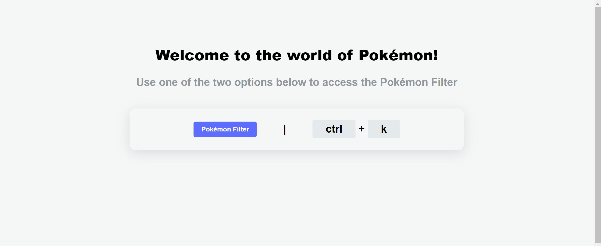
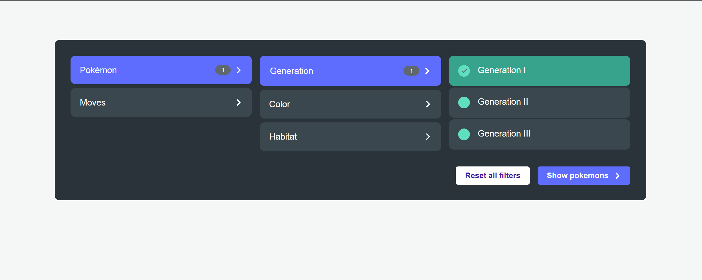
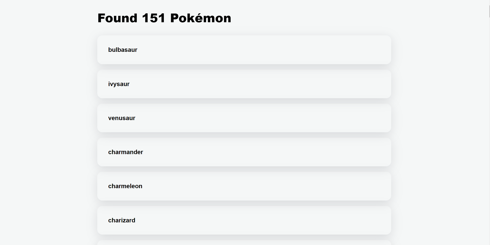

## Pokémon Command Palette

This is Pokémon filter `command palette` 
which lets you find Pokémon & moves through different filtering options.

## [App Link🔗](https://pokemon-command-palette-hq7wzd705-anjaysahoos-projects.vercel.app/search?primary-filter=pokemons&generation=generation-i)

Below are app previews






## To Run This App Locally

#### Step-1

```bash
npm install
```

#### Step-2

Create a `.env.local` file in your project root and add below key-value pair

[**Pokémon API**](https://pokeapi.co/docs/graphql)

```js
NEXT_PUBLIC_API_URL=https://beta.pokeapi.co/graphql/v1beta
```

#### Step-3

```bash
npm run dev
```

Open [http://localhost:3000](http://localhost:3000) with your browser to see the result.

You can start editing the page by modifying `app/page.tsx`. The page auto-updates as you edit the file.

